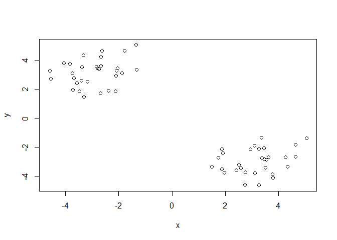
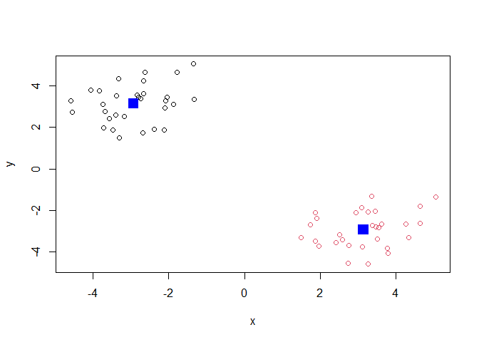
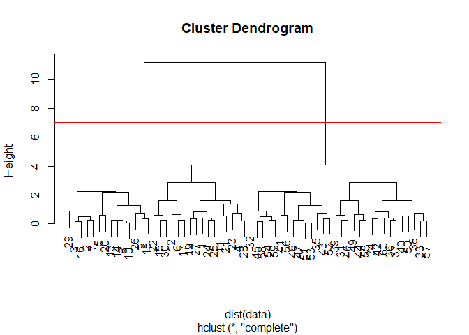
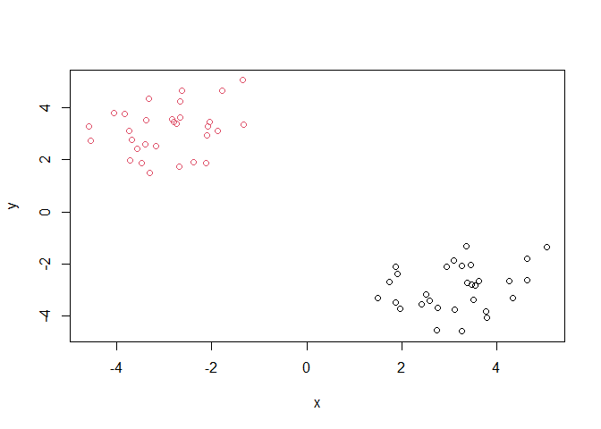
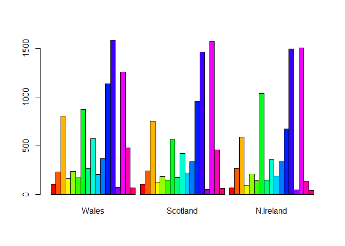
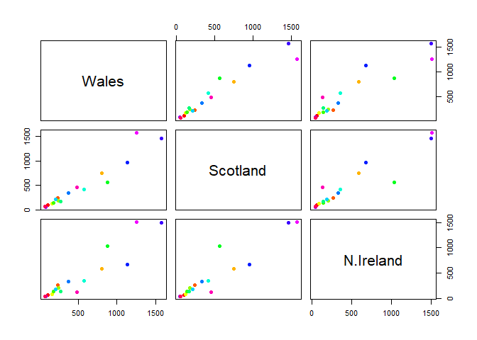
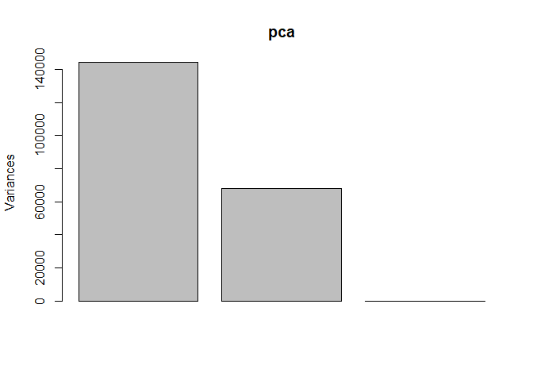
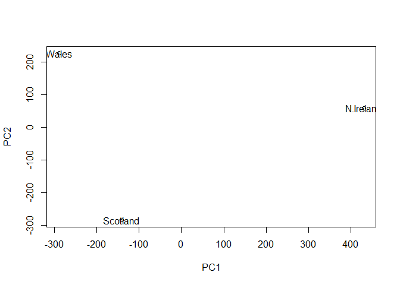
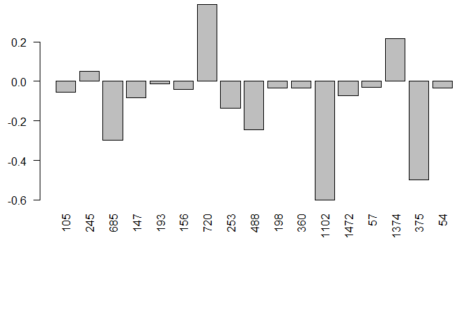
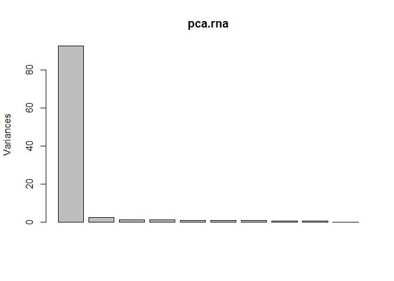

class08
================
Hyeonseok Jang (PID# A59011126)
10/22/2021

#Clustering methods

kmeans clustering in R is done with the ‘kmeans()’ function. Here we
makeup some data to test and learn with.

``` r
tmp <- c(rnorm(30,3), rnorm(30,-3))
data <- cbind(x=tmp, y=rev(tmp))
plot(data)
```

<!-- -->

Run ‘kmeans()’ set k to 2 nstart 20. The thing with kmeans is you have
to tell it how many clusters you want.

``` r
km <- kmeans(data, centers = 2, nstart = 20)
km
```

    ## K-means clustering with 2 clusters of sizes 30, 30
    ## 
    ## Cluster means:
    ##           x         y
    ## 1 -2.933278  3.148251
    ## 2  3.148251 -2.933278
    ## 
    ## Clustering vector:
    ##  [1] 2 2 2 2 2 2 2 2 2 2 2 2 2 2 2 2 2 2 2 2 2 2 2 2 2 2 2 2 2 2 1 1 1 1 1 1 1 1
    ## [39] 1 1 1 1 1 1 1 1 1 1 1 1 1 1 1 1 1 1 1 1 1 1
    ## 
    ## Within cluster sum of squares by cluster:
    ## [1] 46.68215 46.68215
    ##  (between_SS / total_SS =  92.2 %)
    ## 
    ## Available components:
    ## 
    ## [1] "cluster"      "centers"      "totss"        "withinss"     "tot.withinss"
    ## [6] "betweenss"    "size"         "iter"         "ifault"

> Q. How many point are in each cluster?

``` r
km$size
```

    ## [1] 30 30

> Q. What ‘component’ of your result object details cluster
> assignment/membership?

``` r
km$cluster
```

    ##  [1] 2 2 2 2 2 2 2 2 2 2 2 2 2 2 2 2 2 2 2 2 2 2 2 2 2 2 2 2 2 2 1 1 1 1 1 1 1 1
    ## [39] 1 1 1 1 1 1 1 1 1 1 1 1 1 1 1 1 1 1 1 1 1 1

> Q. What ‘component’ of your result object details cluster center?

``` r
km$centers
```

    ##           x         y
    ## 1 -2.933278  3.148251
    ## 2  3.148251 -2.933278

> Q. Plot x colored by the kmeans cluster assignment and add cluster
> centers as blue points

``` r
plot(data, col=km$cluster)
points(km$centers, col="blue", pch=15, cex=2)
```

<!-- -->

# Hierarchical Clustering

We will use the ‘hclust()’ function on the same data as before and see
how this method works.

``` r
hc <- hclust(dist(data))
hc
```

    ## 
    ## Call:
    ## hclust(d = dist(data))
    ## 
    ## Cluster method   : complete 
    ## Distance         : euclidean 
    ## Number of objects: 60

hclust has a plot method

``` r
plot(hc)
abline(h=7, col="red")
```

<!-- -->

To find our membership vector we need to “cut” the tree and for this we
use the ‘cutree()’ functino and tell it the height to cut at.

``` r
cutree(hc, h=7)
```

    ##  [1] 1 1 1 1 1 1 1 1 1 1 1 1 1 1 1 1 1 1 1 1 1 1 1 1 1 1 1 1 1 1 2 2 2 2 2 2 2 2
    ## [39] 2 2 2 2 2 2 2 2 2 2 2 2 2 2 2 2 2 2 2 2 2 2

We can also use ‘cutree()’ and take the number of x clusters we want…

``` r
grps <- cutree(hc, h=7)
```

``` r
plot(data, col=grps)
```

<!-- -->

# Principal Component Analysis (PCA)

PCA is a super useful analysis method when you have lots of dimensions
in your data…

##PCA of UK food data

``` r
url <- "https://tinyurl.com/UK-foods"
x <- read.csv(url, row.names=1)
x
```

    ##                     England Wales Scotland N.Ireland
    ## Cheese                  105   103      103        66
    ## Carcass_meat            245   227      242       267
    ## Other_meat              685   803      750       586
    ## Fish                    147   160      122        93
    ## Fats_and_oils           193   235      184       209
    ## Sugars                  156   175      147       139
    ## Fresh_potatoes          720   874      566      1033
    ## Fresh_Veg               253   265      171       143
    ## Other_Veg               488   570      418       355
    ## Processed_potatoes      198   203      220       187
    ## Processed_Veg           360   365      337       334
    ## Fresh_fruit            1102  1137      957       674
    ## Cereals                1472  1582     1462      1494
    ## Beverages                57    73       53        47
    ## Soft_drinks            1374  1256     1572      1506
    ## Alcoholic_drinks        375   475      458       135
    ## Confectionery            54    64       62        41

How many rows and cols?

``` r
dim(x)
```

    ## [1] 17  4

``` r
x
```

    ##                     England Wales Scotland N.Ireland
    ## Cheese                  105   103      103        66
    ## Carcass_meat            245   227      242       267
    ## Other_meat              685   803      750       586
    ## Fish                    147   160      122        93
    ## Fats_and_oils           193   235      184       209
    ## Sugars                  156   175      147       139
    ## Fresh_potatoes          720   874      566      1033
    ## Fresh_Veg               253   265      171       143
    ## Other_Veg               488   570      418       355
    ## Processed_potatoes      198   203      220       187
    ## Processed_Veg           360   365      337       334
    ## Fresh_fruit            1102  1137      957       674
    ## Cereals                1472  1582     1462      1494
    ## Beverages                57    73       53        47
    ## Soft_drinks            1374  1256     1572      1506
    ## Alcoholic_drinks        375   475      458       135
    ## Confectionery            54    64       62        41

``` r
rownames(x) <- x[,1]
x <- x[,-1]
x
```

    ##      Wales Scotland N.Ireland
    ## 105    103      103        66
    ## 245    227      242       267
    ## 685    803      750       586
    ## 147    160      122        93
    ## 193    235      184       209
    ## 156    175      147       139
    ## 720    874      566      1033
    ## 253    265      171       143
    ## 488    570      418       355
    ## 198    203      220       187
    ## 360    365      337       334
    ## 1102  1137      957       674
    ## 1472  1582     1462      1494
    ## 57      73       53        47
    ## 1374  1256     1572      1506
    ## 375    475      458       135
    ## 54      64       62        41

``` r
barplot(as.matrix(x), col=rainbow(17), beside=TRUE)
```

<!-- -->

``` r
mycols <- rainbow(nrow(x))
pairs(x, col=mycols, pch=16)
```

<!-- -->

##PCA to the rescue!

Here we will use the base R function for PCA, which is called
‘prcomp()’. This function wants the transpose of data.

``` r
pca <- prcomp(t(x))
summary(pca)
```

    ## Importance of components:
    ##                             PC1      PC2       PC3
    ## Standard deviation     379.8991 260.5533 1.515e-13
    ## Proportion of Variance   0.6801   0.3199 0.000e+00
    ## Cumulative Proportion    0.6801   1.0000 1.000e+00

``` r
plot(pca)
```

<!-- -->

We want score plot (a.k.a. PCA plot).

``` r
attributes(pca)
```

    ## $names
    ## [1] "sdev"     "rotation" "center"   "scale"    "x"       
    ## 
    ## $class
    ## [1] "prcomp"

We are after the pca$x component for this plot…

``` r
plot(pca$x[,1:2])
text(pca$x[,1:2], labels = colnames(x))
```

<!-- -->

We can also examine the PCA “loadings”, which tell us how much the
original variables contribute to each new PC…

``` r
pca$rotation
```

    ##              PC1          PC2          PC3
    ## 105  -0.05515951 -0.015926208 -0.148219191
    ## 245   0.05228588 -0.014247351  0.049940338
    ## 685  -0.29754711  0.017770827 -0.099243179
    ## 147  -0.08127351  0.050871661 -0.034255617
    ## 193  -0.01378426  0.095789177 -0.074086293
    ## 156  -0.03995614  0.043238659  0.057974411
    ## 720   0.38787509  0.714518360 -0.215202082
    ## 253  -0.13584223  0.144666425 -0.064779083
    ## 488  -0.24608178  0.226299860 -0.261412889
    ## 198  -0.03217825 -0.042547197 -0.088254801
    ## 360  -0.03250215  0.045390849  0.134256830
    ## 1102 -0.60208698  0.178285653  0.060817375
    ## 1472 -0.07242201  0.213840430 -0.653256627
    ## 57   -0.02896604  0.030761774  0.002730557
    ## 1374  0.21794320 -0.555250465 -0.590839025
    ## 375  -0.49854565 -0.110688746 -0.177303245
    ## 54   -0.03330887 -0.005704759  0.005307787

``` r
par(mar=c(10, 3, 0.35, 0))
barplot( pca$rotation[,1], las = 2)
```

<!-- -->

## One more PCA for today

``` r
url2 <- "https://tinyurl.com/expression-CSV"
rna.data <- read.csv(url2, row.names=1)
head(rna.data)
```

    ##        wt1 wt2  wt3  wt4 wt5 ko1 ko2 ko3 ko4 ko5
    ## gene1  439 458  408  429 420  90  88  86  90  93
    ## gene2  219 200  204  210 187 427 423 434 433 426
    ## gene3 1006 989 1030 1017 973 252 237 238 226 210
    ## gene4  783 792  829  856 760 849 856 835 885 894
    ## gene5  181 249  204  244 225 277 305 272 270 279
    ## gene6  460 502  491  491 493 612 594 577 618 638

``` r
nrow(rna.data)
```

    ## [1] 100

``` r
ncol(rna.data)
```

    ## [1] 10

``` r
colnames(rna.data)
```

    ##  [1] "wt1" "wt2" "wt3" "wt4" "wt5" "ko1" "ko2" "ko3" "ko4" "ko5"

``` r
pca.rna <- prcomp(t(rna.data), scale=TRUE)
summary(pca.rna)
```

    ## Importance of components:
    ##                           PC1    PC2     PC3     PC4     PC5     PC6     PC7
    ## Standard deviation     9.6237 1.5198 1.05787 1.05203 0.88062 0.82545 0.80111
    ## Proportion of Variance 0.9262 0.0231 0.01119 0.01107 0.00775 0.00681 0.00642
    ## Cumulative Proportion  0.9262 0.9493 0.96045 0.97152 0.97928 0.98609 0.99251
    ##                            PC8     PC9      PC10
    ## Standard deviation     0.62065 0.60342 3.348e-15
    ## Proportion of Variance 0.00385 0.00364 0.000e+00
    ## Cumulative Proportion  0.99636 1.00000 1.000e+00

``` r
plot(pca.rna)
```

<!-- -->

``` r
plot(pca.rna$x[,1:2])
text(pca.rna$x[,1:2], labels = colnames(rna.data))
```

<!-- -->
