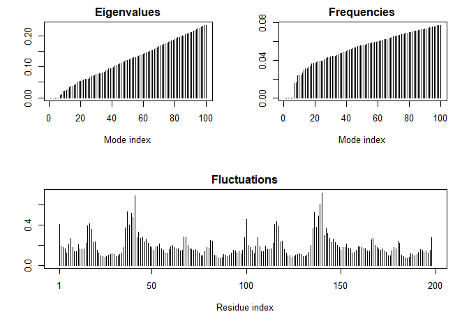

class11
================
Hyeonseok Jang (PID# A59011126)
11/3/2021

``` r
db <- read.csv("Data Export Summary.csv", row.names=1)
```

> Q1: What percentage of structures in the PDB are solved by X-Ray and
> Electron Microscopy.

``` r
round(sum(db$X.ray)/sum(db$Total)*100, 2)
```

    ## [1] 87.53

How about doing this over every method (i.e. coln in the little table)

``` r
round(colSums(db)/sum(db$Total)*100, 2)
```

    ##            X.ray              NMR               EM Multiple.methods 
    ##            87.53             7.36             4.95             0.11 
    ##          Neutron            Other            Total 
    ##             0.04             0.02           100.00

> Q2: What proportion of structures in the PDB are protein?

``` r
round(db$Total[1]/sum(db$Total)*100, 2)
```

    ## [1] 87.35

> Q3: Type HIV in the PDB website search box on the home page and
> determine how many HIV-1 protease structures are in the current PDB?

22824 structures

``` r
library(bio3d)
pdb <- read.pdb("1hsg")
```

    ##   Note: Accessing on-line PDB file

``` r
pdb
```

    ## 
    ##  Call:  read.pdb(file = "1hsg")
    ## 
    ##    Total Models#: 1
    ##      Total Atoms#: 1686,  XYZs#: 5058  Chains#: 2  (values: A B)
    ## 
    ##      Protein Atoms#: 1514  (residues/Calpha atoms#: 198)
    ##      Nucleic acid Atoms#: 0  (residues/phosphate atoms#: 0)
    ## 
    ##      Non-protein/nucleic Atoms#: 172  (residues: 128)
    ##      Non-protein/nucleic resid values: [ HOH (127), MK1 (1) ]
    ## 
    ##    Protein sequence:
    ##       PQITLWQRPLVTIKIGGQLKEALLDTGADDTVLEEMSLPGRWKPKMIGGIGGFIKVRQYD
    ##       QILIEICGHKAIGTVLVGPTPVNIIGRNLLTQIGCTLNFPQITLWQRPLVTIKIGGQLKE
    ##       ALLDTGADDTVLEEMSLPGRWKPKMIGGIGGFIKVRQYDQILIEICGHKAIGTVLVGPTP
    ##       VNIIGRNLLTQIGCTLNF
    ## 
    ## + attr: atom, xyz, seqres, helix, sheet,
    ##         calpha, remark, call

``` r
m <- nma(pdb)
```

    ## Warning in nma.pdb(pdb): Possible multi-chain structure or missing in-structure residue(s) present
    ##   Fluctuations at neighboring positions may be affected.

    ##  Building Hessian...     Done in 0.04 seconds.
    ##  Diagonalizing Hessian...    Done in 0.2 seconds.

``` r
plot(m)
```

<!-- -->

Make a little movie (trajectory) for viewing in VMD.

``` r
mktrj(m, file="nma.pdb")
```
