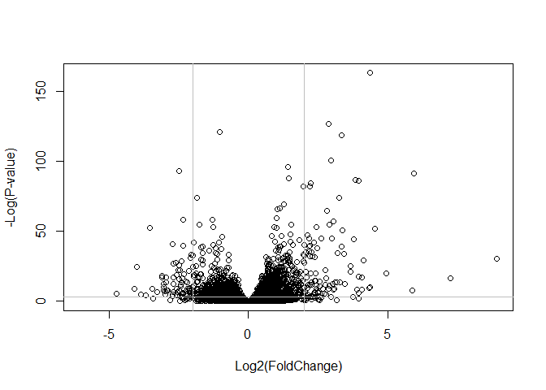

class15
================
Hyeonseok Jang (PID# A59011126)
11/17/2021

``` r
#install.packages("BiocManager")
#BiocManager::install()
```

``` r
#For this class, you'll also need DESeq2:
#BiocManager::install("DESeq2")
```

``` r
library(BiocManager)
library(DESeq2)
```

    ## Loading required package: S4Vectors

    ## Loading required package: stats4

    ## Loading required package: BiocGenerics

    ## 
    ## Attaching package: 'BiocGenerics'

    ## The following objects are masked from 'package:stats':
    ## 
    ##     IQR, mad, sd, var, xtabs

    ## The following objects are masked from 'package:base':
    ## 
    ##     anyDuplicated, append, as.data.frame, basename, cbind, colnames,
    ##     dirname, do.call, duplicated, eval, evalq, Filter, Find, get, grep,
    ##     grepl, intersect, is.unsorted, lapply, Map, mapply, match, mget,
    ##     order, paste, pmax, pmax.int, pmin, pmin.int, Position, rank,
    ##     rbind, Reduce, rownames, sapply, setdiff, sort, table, tapply,
    ##     union, unique, unsplit, which.max, which.min

    ## 
    ## Attaching package: 'S4Vectors'

    ## The following objects are masked from 'package:base':
    ## 
    ##     expand.grid, I, unname

    ## Loading required package: IRanges

    ## 
    ## Attaching package: 'IRanges'

    ## The following object is masked from 'package:grDevices':
    ## 
    ##     windows

    ## Loading required package: GenomicRanges

    ## Loading required package: GenomeInfoDb

    ## Loading required package: SummarizedExperiment

    ## Loading required package: MatrixGenerics

    ## Loading required package: matrixStats

    ## 
    ## Attaching package: 'MatrixGenerics'

    ## The following objects are masked from 'package:matrixStats':
    ## 
    ##     colAlls, colAnyNAs, colAnys, colAvgsPerRowSet, colCollapse,
    ##     colCounts, colCummaxs, colCummins, colCumprods, colCumsums,
    ##     colDiffs, colIQRDiffs, colIQRs, colLogSumExps, colMadDiffs,
    ##     colMads, colMaxs, colMeans2, colMedians, colMins, colOrderStats,
    ##     colProds, colQuantiles, colRanges, colRanks, colSdDiffs, colSds,
    ##     colSums2, colTabulates, colVarDiffs, colVars, colWeightedMads,
    ##     colWeightedMeans, colWeightedMedians, colWeightedSds,
    ##     colWeightedVars, rowAlls, rowAnyNAs, rowAnys, rowAvgsPerColSet,
    ##     rowCollapse, rowCounts, rowCummaxs, rowCummins, rowCumprods,
    ##     rowCumsums, rowDiffs, rowIQRDiffs, rowIQRs, rowLogSumExps,
    ##     rowMadDiffs, rowMads, rowMaxs, rowMeans2, rowMedians, rowMins,
    ##     rowOrderStats, rowProds, rowQuantiles, rowRanges, rowRanks,
    ##     rowSdDiffs, rowSds, rowSums2, rowTabulates, rowVarDiffs, rowVars,
    ##     rowWeightedMads, rowWeightedMeans, rowWeightedMedians,
    ##     rowWeightedSds, rowWeightedVars

    ## Loading required package: Biobase

    ## Welcome to Bioconductor
    ## 
    ##     Vignettes contain introductory material; view with
    ##     'browseVignettes()'. To cite Bioconductor, see
    ##     'citation("Biobase")', and for packages 'citation("pkgname")'.

    ## 
    ## Attaching package: 'Biobase'

    ## The following object is masked from 'package:MatrixGenerics':
    ## 
    ##     rowMedians

    ## The following objects are masked from 'package:matrixStats':
    ## 
    ##     anyMissing, rowMedians

##Import countData and colData

``` r
counts <- read.csv("airway_scaledcounts.csv", row.names=1)
metadata <-  read.csv("airway_metadata.csv")
```

``` r
head(counts)
```

    ##                 SRR1039508 SRR1039509 SRR1039512 SRR1039513 SRR1039516
    ## ENSG00000000003        723        486        904        445       1170
    ## ENSG00000000005          0          0          0          0          0
    ## ENSG00000000419        467        523        616        371        582
    ## ENSG00000000457        347        258        364        237        318
    ## ENSG00000000460         96         81         73         66        118
    ## ENSG00000000938          0          0          1          0          2
    ##                 SRR1039517 SRR1039520 SRR1039521
    ## ENSG00000000003       1097        806        604
    ## ENSG00000000005          0          0          0
    ## ENSG00000000419        781        417        509
    ## ENSG00000000457        447        330        324
    ## ENSG00000000460         94        102         74
    ## ENSG00000000938          0          0          0

``` r
head(metadata)
```

    ##           id     dex celltype     geo_id
    ## 1 SRR1039508 control   N61311 GSM1275862
    ## 2 SRR1039509 treated   N61311 GSM1275863
    ## 3 SRR1039512 control  N052611 GSM1275866
    ## 4 SRR1039513 treated  N052611 GSM1275867
    ## 5 SRR1039516 control  N080611 GSM1275870
    ## 6 SRR1039517 treated  N080611 GSM1275871

Sidenote: Let’s check the correspondence of the metadata and count data
setup.

``` r
all(metadata$id==colnames(counts))
```

    ## [1] TRUE

> Q1. How many genes are in this dataset?

``` r
nrow(counts)
```

    ## [1] 38694

> Q2. How many ‘control’ cell lines do we have?

``` r
sum(metadata$dex == "control")
```

    ## [1] 4

##Compare control to treated

> Q3. How would you make the above code in either approach more robust?

``` r
control.inds <- metadata$dex == "control"
control.ids <- metadata[control.inds,]$id
```

``` r
head(counts[,control.ids])
```

    ##                 SRR1039508 SRR1039512 SRR1039516 SRR1039520
    ## ENSG00000000003        723        904       1170        806
    ## ENSG00000000005          0          0          0          0
    ## ENSG00000000419        467        616        582        417
    ## ENSG00000000457        347        364        318        330
    ## ENSG00000000460         96         73        118        102
    ## ENSG00000000938          0          1          2          0

``` r
control.mean <- rowMeans(counts[,control.ids])
head(control.mean)
```

    ## ENSG00000000003 ENSG00000000005 ENSG00000000419 ENSG00000000457 ENSG00000000460 
    ##          900.75            0.00          520.50          339.75           97.25 
    ## ENSG00000000938 
    ##            0.75

> Q4. Follow the same procedure for the treated samples (i.e. calculate
> the mean per gene across drug treated samples and assign to a labeled
> vector called treated.mean)

``` r
treated.ids <- metadata[metadata$dex == "treated",]$id
treated.mean <- rowMeans(counts[,treated.ids])
```

``` r
meancounts <- data.frame(control.mean, treated.mean)
```

> Q5 (a). Create a scatter plot showing the mean of the treated samples
> against the mean of the control samples. Your plot should look
> something like the following.

``` r
plot(meancounts, xlab="Control", ylab="Treated")
```

<!-- -->

> Q6. Try plotting both axes on a log scale. What is the argument to
> plot() that allows you to do this?

``` r
plot(meancounts, log="xy")
```

    ## Warning in xy.coords(x, y, xlabel, ylabel, log): 15032 x values <= 0 omitted
    ## from logarithmic plot

    ## Warning in xy.coords(x, y, xlabel, ylabel, log): 15281 y values <= 0 omitted
    ## from logarithmic plot

<!-- -->

``` r
meancounts$log2fc <- log2(meancounts[,"treated.mean"]/meancounts[,"control.mean"])
head(meancounts)
```

    ##                 control.mean treated.mean      log2fc
    ## ENSG00000000003       900.75       658.00 -0.45303916
    ## ENSG00000000005         0.00         0.00         NaN
    ## ENSG00000000419       520.50       546.00  0.06900279
    ## ENSG00000000457       339.75       316.50 -0.10226805
    ## ENSG00000000460        97.25        78.75 -0.30441833
    ## ENSG00000000938         0.75         0.00        -Inf

``` r
inds <- which(meancounts[,1:2]==0, arr.ind=TRUE)
to.rm <- unique(sort(inds[,"row"]))

mycounts <- meancounts[-to.rm, ]
```

What percentage of genes are above the fold-change threshold of +2 or
greater?

``` r
round(sum(mycounts$log2fc > +2)/nrow(mycounts) * 100, 2)
```

    ## [1] 1.15

How about down?

``` r
round(sum(mycounts$log2fc < -2)/nrow(mycounts) * 100, 2)
```

    ## [1] 1.68

## DESeq2 analysis

We first need to setup the data for DESeq2

``` r
dds <- DESeqDataSetFromMatrix(countData=counts, 
                              colData=metadata, 
                              design=~dex)
```

    ## converting counts to integer mode

    ## Warning in DESeqDataSet(se, design = design, ignoreRank): some variables in
    ## design formula are characters, converting to factors

Run the DESeq analysis pipeline.

``` r
dds <- DESeq(dds)
```

    ## estimating size factors

    ## estimating dispersions

    ## gene-wise dispersion estimates

    ## mean-dispersion relationship

    ## final dispersion estimates

    ## fitting model and testing

``` r
res <- results(dds)
head(res)
```

    ## log2 fold change (MLE): dex treated vs control 
    ## Wald test p-value: dex treated vs control 
    ## DataFrame with 6 rows and 6 columns
    ##                   baseMean log2FoldChange     lfcSE      stat    pvalue
    ##                  <numeric>      <numeric> <numeric> <numeric> <numeric>
    ## ENSG00000000003 747.194195     -0.3507030  0.168246 -2.084470 0.0371175
    ## ENSG00000000005   0.000000             NA        NA        NA        NA
    ## ENSG00000000419 520.134160      0.2061078  0.101059  2.039475 0.0414026
    ## ENSG00000000457 322.664844      0.0245269  0.145145  0.168982 0.8658106
    ## ENSG00000000460  87.682625     -0.1471420  0.257007 -0.572521 0.5669691
    ## ENSG00000000938   0.319167     -1.7322890  3.493601 -0.495846 0.6200029
    ##                      padj
    ##                 <numeric>
    ## ENSG00000000003  0.163035
    ## ENSG00000000005        NA
    ## ENSG00000000419  0.176032
    ## ENSG00000000457  0.961694
    ## ENSG00000000460  0.815849
    ## ENSG00000000938        NA

## Volcano Plot

``` r
plot(res$log2FoldChange, -log(res$padj), ylab="-Log(P-value)", xlab="Log2(FoldChange)")
abline(v=c(-2,2), col="gray")
abline(h=-log(0.05), col="gray")
```

<!-- -->

## Adding annotation data

We want to add meaningful gene names to our dataset so we can make some
sense of what is going on here…

For this we will use two bioconductor packages, one does the work and is
called **AnnotationDbi** the other is to contain the data and called
**org.Hs.eg.db**

``` r
#BiocManager::install("AnnotationDbi")
#BiocManager::install("org.Hs.eg.db")

library("AnnotationDbi")
library("org.Hs.eg.db")
```

    ## 

Here we map to “SYMBOL” the common gene name that the world understands
and wants.

``` r
res$symbol <- mapIds(org.Hs.eg.db,
                     keys=row.names(res), 
                     keytype="ENSEMBL",       
                     column="SYMBOL",
                     multiVals="first")
```

    ## 'select()' returned 1:many mapping between keys and columns

``` r
head(res$symbol)
```

    ## ENSG00000000003 ENSG00000000005 ENSG00000000419 ENSG00000000457 ENSG00000000460 
    ##        "TSPAN6"          "TNMD"          "DPM1"         "SCYL3"      "C1orf112" 
    ## ENSG00000000938 
    ##           "FGR"

## Lets finally save the result to data

``` r
write.csv(res, file="allmyresults.csv")
```

## Pathway Analysis

Let’s try to bring some biology insight back into this work. For this we
will start with KEGG.

``` r
library(pathview)
library(gage)
library(gageData)
```

``` r
data(kegg.sets.hs)

# Examine the first 2 pathways in this kegg set for humans
head(kegg.sets.hs, 2)
```

    ## $`hsa00232 Caffeine metabolism`
    ## [1] "10"   "1544" "1548" "1549" "1553" "7498" "9"   
    ## 
    ## $`hsa00983 Drug metabolism - other enzymes`
    ##  [1] "10"     "1066"   "10720"  "10941"  "151531" "1548"   "1549"   "1551"  
    ##  [9] "1553"   "1576"   "1577"   "1806"   "1807"   "1890"   "221223" "2990"  
    ## [17] "3251"   "3614"   "3615"   "3704"   "51733"  "54490"  "54575"  "54576" 
    ## [25] "54577"  "54578"  "54579"  "54600"  "54657"  "54658"  "54659"  "54963" 
    ## [33] "574537" "64816"  "7083"   "7084"   "7172"   "7363"   "7364"   "7365"  
    ## [41] "7366"   "7367"   "7371"   "7372"   "7378"   "7498"   "79799"  "83549" 
    ## [49] "8824"   "8833"   "9"      "978"

Before we can use KEGG we need to get our gene identifiers in the
correct format for KEGG, which is ENTREZ format in this case.

``` r
columns(org.Hs.eg.db)
```

    ##  [1] "ACCNUM"       "ALIAS"        "ENSEMBL"      "ENSEMBLPROT"  "ENSEMBLTRANS"
    ##  [6] "ENTREZID"     "ENZYME"       "EVIDENCE"     "EVIDENCEALL"  "GENENAME"    
    ## [11] "GENETYPE"     "GO"           "GOALL"        "IPI"          "MAP"         
    ## [16] "OMIM"         "ONTOLOGY"     "ONTOLOGYALL"  "PATH"         "PFAM"        
    ## [21] "PMID"         "PROSITE"      "REFSEQ"       "SYMBOL"       "UCSCKG"      
    ## [26] "UNIPROT"

``` r
res$entrez <- mapIds(org.Hs.eg.db,
                     keys=row.names(res), 
                     keytype="ENSEMBL",       
                     column="ENTREZID",
                     multiVals="first")
```

    ## 'select()' returned 1:many mapping between keys and columns

``` r
res$genename <- mapIds(org.Hs.eg.db,
                     keys=row.names(res), 
                     keytype="ENSEMBL",       
                     column="GENENAME",
                     multiVals="first")
```

    ## 'select()' returned 1:many mapping between keys and columns

``` r
head(res)
```

    ## log2 fold change (MLE): dex treated vs control 
    ## Wald test p-value: dex treated vs control 
    ## DataFrame with 6 rows and 9 columns
    ##                   baseMean log2FoldChange     lfcSE      stat    pvalue
    ##                  <numeric>      <numeric> <numeric> <numeric> <numeric>
    ## ENSG00000000003 747.194195     -0.3507030  0.168246 -2.084470 0.0371175
    ## ENSG00000000005   0.000000             NA        NA        NA        NA
    ## ENSG00000000419 520.134160      0.2061078  0.101059  2.039475 0.0414026
    ## ENSG00000000457 322.664844      0.0245269  0.145145  0.168982 0.8658106
    ## ENSG00000000460  87.682625     -0.1471420  0.257007 -0.572521 0.5669691
    ## ENSG00000000938   0.319167     -1.7322890  3.493601 -0.495846 0.6200029
    ##                      padj      symbol      entrez               genename
    ##                 <numeric> <character> <character>            <character>
    ## ENSG00000000003  0.163035      TSPAN6        7105          tetraspanin 6
    ## ENSG00000000005        NA        TNMD       64102            tenomodulin
    ## ENSG00000000419  0.176032        DPM1        8813 dolichyl-phosphate m..
    ## ENSG00000000457  0.961694       SCYL3       57147 SCY1 like pseudokina..
    ## ENSG00000000460  0.815849    C1orf112       55732 chromosome 1 open re..
    ## ENSG00000000938        NA         FGR        2268 FGR proto-oncogene, ..

The main **gage()** function requires a named vector of fold changes,
where the names of the values are the Entrez gene IDs.

Note that we used the mapIDs() function above to obtain Entrez gene IDs
(stored in
res*e**n**t**r**e**z*)*a**n**d**w**e**h**a**v**e**t**h**e**f**o**l**d**c**h**a**n**g**e**r**e**s**u**l**t**s**f**r**o**m**D**E**S**e**q*2*a**n**a**l**y**s**i**s*(*s**t**o**r**e**d**i**n**r**e**s*log2FoldChange).

``` r
foldchanges = res$log2FoldChange
head(foldchanges)
```

    ## [1] -0.35070302          NA  0.20610777  0.02452695 -0.14714205 -1.73228897

Assign names to this vector that are the gene IDs that KEGG wants.

``` r
names(foldchanges) = res$entrez
head(foldchanges)
```

    ##        7105       64102        8813       57147       55732        2268 
    ## -0.35070302          NA  0.20610777  0.02452695 -0.14714205 -1.73228897

Now we are ready for the **gage()** function.

``` r
keggres = gage(foldchanges, gsets=kegg.sets.hs)
```

We can look at the attributes() of this or indded any R object.

``` r
attributes(keggres)
```

    ## $names
    ## [1] "greater" "less"    "stats"

``` r
head(keggres$less)
```

    ##                                                          p.geomean stat.mean
    ## hsa05332 Graft-versus-host disease                    0.0004250461 -3.473346
    ## hsa04940 Type I diabetes mellitus                     0.0017820293 -3.002352
    ## hsa05310 Asthma                                       0.0020045888 -3.009050
    ## hsa04672 Intestinal immune network for IgA production 0.0060434515 -2.560547
    ## hsa05330 Allograft rejection                          0.0073678825 -2.501419
    ## hsa04340 Hedgehog signaling pathway                   0.0133239547 -2.248547
    ##                                                              p.val      q.val
    ## hsa05332 Graft-versus-host disease                    0.0004250461 0.09053483
    ## hsa04940 Type I diabetes mellitus                     0.0017820293 0.14232581
    ## hsa05310 Asthma                                       0.0020045888 0.14232581
    ## hsa04672 Intestinal immune network for IgA production 0.0060434515 0.31387180
    ## hsa05330 Allograft rejection                          0.0073678825 0.31387180
    ## hsa04340 Hedgehog signaling pathway                   0.0133239547 0.47300039
    ##                                                       set.size         exp1
    ## hsa05332 Graft-versus-host disease                          40 0.0004250461
    ## hsa04940 Type I diabetes mellitus                           42 0.0017820293
    ## hsa05310 Asthma                                             29 0.0020045888
    ## hsa04672 Intestinal immune network for IgA production       47 0.0060434515
    ## hsa05330 Allograft rejection                                36 0.0073678825
    ## hsa04340 Hedgehog signaling pathway                         56 0.0133239547

The **pathview()** function will add out genes to a KEGG pathway as
colored entries:

``` r
pathview(gene.data=foldchanges, pathway.id="hsa05310")
```

    ## 'select()' returned 1:1 mapping between keys and columns

    ## Info: Working in directory C:/Users/Hyeonseok/Desktop/BGGN213/BGGN_213/class15

    ## Info: Writing image file hsa05310.pathview.png


