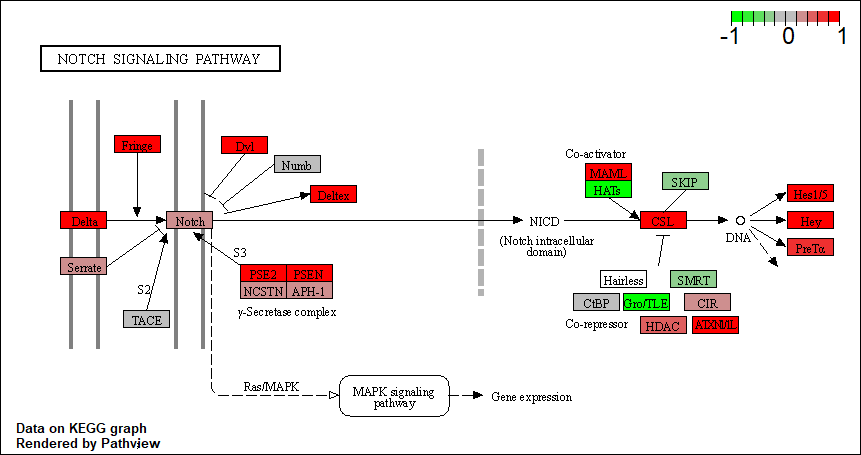

# Background

> Trapnell C, Hendrickson DG, Sauvageau M, Goff L et al. "Differential analysis of gene regulation at transcript resolution with RNA-seq". Nat Biotechnol 2013 Jan;31(1):46-53. PMID: 23222703

THe authors report an differential analysis of lung fibroblasts in response to loss of the developmental transcription factor HOXA1.


# 1. Data Import

Read in the countdata and coldata that we need, and have a wee look.
```{r}
metaFile <- "GSE37704_metadata.csv"
countFile <- "GSE37704_featurecounts.csv"

# Import metadata and take a peak
colData = read.csv(metaFile, row.names=1)
head(colData)

# Import countdata
countData = read.csv(countFile, row.names=1)
head(countData)
```

```{r}
# Note we need to remove the odd first $length col
countData <- as.matrix(countData[,-1])
head(countData)
```

```{r}
# Filter count data where you have 0 read count across all samples.
counts <- countData[rowSums(countData)!=0,]
head(counts)
```


# 2. PCA for Quality Control

I am going to use the base R 'prcomp()' function for PCA of our counts data (form which I have removed the zero count genes).
```{r}
pca <- prcomp(t(counts))
summary(pca)
```

Quick plot
```{r}
plot(pca$x[,1:2])
```

```{r}
plot(pca$x[,1:2], pch=16, col=as.factor(colData$condition))
text(pca$x[,1:2], labels = colData$condition)
```

Or a ggplot version
```{r}
library(ggplot2)

x <- as.data.frame(pca$x)
x$condition <- colData$condition

ggplot(x) +
  aes(PC1, PC2, col=condition) +
  geom_point()
```

This looks fine - the first PC separates the control group and experimental group well.


# 3. DESeq analysis

```{r}
library(DESeq2)

dds = DESeqDataSetFromMatrix(countData=counts,
                             colData=colData,
                             design=~condition)
```

And run the results.
```{r}
dds <- DESeq(dds)
res <- results(dds)

summary(res)
```


# 4. Volcano Plot

Let's make a volcano plot.
```{r}
plot(res$log2FoldChange, -log(res$padj))
```

I can improve this plot by the below code, which adds color and axis labels.
```{r}
# Make a color vector for all genes
mycols <- rep("gray", nrow(res))

# Color red the genes with absolute fold change above 2
mycols[abs(res$log2FoldChange)>2] <- "red"

# Color blue those with adjusted p-value less than 0.01
#  and absolute fold change more than 2
inds <- ((res$pvalue)<0.01) & (abs(res$log2FoldChange)>2)
mycols[inds] <- "blue"

plot(res$log2FoldChange, -log(res$padj), col=mycols, xlab="Log2(FoldChange)", ylab="-Log(P-value)")
```


# 5. Annotation

I can use the mapIDs() function multiple times to add SYMBOL, ENTREZID and GENENAME annotation to our results by the code below.
```{r}
library("AnnotationDbi")
library("org.Hs.eg.db")

columns(org.Hs.eg.db)

res$symbol = mapIds(org.Hs.eg.db,
                    keys=row.names(res), 
                    keytype="ENSEMBL",
                    column="SYMBOL",
                    multiVals="first")

res$entrez = mapIds(org.Hs.eg.db,
                    keys=row.names(res),
                    keytype="ENSEMBL",
                    column="ENTREZID",
                    multiVals="first")

res$name =   mapIds(org.Hs.eg.db,
                    keys=row.names(res),
                    keytype="ENSEMBL",
                    column="GENENAME",
                    multiVals="first")

head(res, 10)
```

Let's reorder these results by adjusted p-value and save them to a CSV file in your current project directory.
```{r}
res = res[order(res$pvalue),]
write.csv(res, file="deseq_results.csv")
```


# 6. Pathway Analysis

I can load the packages and setup the KEGG data-sets we need.
```{r message=FALSE}
library(pathview)
```

```{r}
library(gage)
library(gageData)

data(kegg.sets.hs)
data(sigmet.idx.hs)

# Focus on signaling and metabolic pathways only
kegg.sets.hs = kegg.sets.hs[sigmet.idx.hs]

# Examine the first 3 pathways
head(kegg.sets.hs, 3)
```

Make the input foldchange vector for KEGG and GO etc.
```{r}
foldchanges = res$log2FoldChange
names(foldchanges) = res$entrez
head(foldchanges)
```

Now, let’s run the gage pathway analysis.
```{r}
keggres = gage(foldchanges, gsets=kegg.sets.hs)
```

```{r}
attributes(keggres)

# Look at the first few down (less) pathways
head(keggres$less)
```

Let's try out the **pathview()** function from the pathview package to make a pathway plot with our RNA-Seq expression results shown in color.
```{r}
pathview(gene.data=foldchanges, pathway.id="hsa04110")
```


A different PDF based output of the same data
```{r}
pathview(gene.data=foldchanges, pathway.id="hsa04110", kegg.native=FALSE)
```

```{r}
## Focus on top 5 upregulated pathways here for demo purposes only
keggrespathways <- rownames(keggres$greater)[1:5]

# Extract the 8 character long IDs part of each string
keggresids = substr(keggrespathways, start=1, stop=8)
keggresids
```

```{r}
pathview(gene.data=foldchanges, pathway.id=keggresids, species="hsa")
```




I can do the same procedure as above to plot the pathview figures for the top 5 down-reguled pathways.
```{r}
keggrespathways.down <- rownames(keggres$less)[1:5]

keggresids.down = substr(keggrespathways.down, start=1, stop=8)
keggresids.down
```

```{r}
pathview(gene.data=foldchanges, pathway.id=keggresids.down, species="hsa")
```


