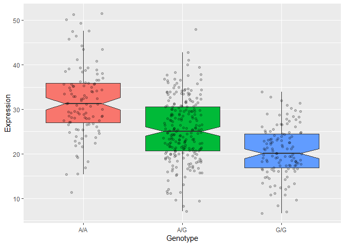

class19
================
Hyeonseok Jang (PID# A59011126)
12/3/2021

## Section 4: Population Scale Analysis

One sample is obviously not enough to know what is happening in a
population. You are interested in assessing genetic differences on a
population scale.

Now, I want to find whether there is any association of the 4
asthma-associated SNPs (rs8067378…) on ORMDL3 expression.

> Q13: Read this file into R and determine the sample size for each
> genotype and their corresponding median expression levels for each of
> these genotypes.

``` r
expr <- read.table("rs8067378_ENSG00000172057.6.txt")
```

``` r
table(expr$geno)
```

    ## 
    ## A/A A/G G/G 
    ## 108 233 121

The sample sizes for each genotypes are 108(A/A), 233(A/G), and
121(G/G).

``` r
summary(expr[expr$geno=="A/A",]$exp)
```

    ##    Min. 1st Qu.  Median    Mean 3rd Qu.    Max. 
    ##   11.40   27.02   31.25   31.82   35.92   51.52

``` r
summary(expr[expr$geno=="A/G",]$exp)
```

    ##    Min. 1st Qu.  Median    Mean 3rd Qu.    Max. 
    ##   7.075  20.626  25.065  25.397  30.552  48.034

``` r
summary(expr[expr$geno=="G/G",]$exp)
```

    ##    Min. 1st Qu.  Median    Mean 3rd Qu.    Max. 
    ##   6.675  16.903  20.074  20.594  24.457  33.956

The median expression levels for each of these genotypes are 31.25(A/A),
25.065(A/G), and 20.074(G/G).

> Q14: Generate a boxplot with a box per genotype, what could you infer
> from the relative expression value between A/A and G/G displayed in
> this plot? Does the SNP effect the expression of ORMDL3?

``` r
library(ggplot2)

ggplot(expr) + aes(geno, exp, fill=geno) +
  geom_boxplot(outlier.shape=NA, notch=TRUE) +
  geom_jitter(width=0.2, alpha=0.2) +
  xlab("Genotype") + ylab("Expression") +
  theme(legend.position="none")
```

<!-- --> I can see
clear difference in expression value between A/A and G/G. Based on the
observation, I think that having a G/G is associated with the reduced
expression of the gene.
